# SAGE Progress Framing for Presentation — Balanced 50% Complete / 50% Next Phase

This document reframes the submitted **Agentic Neuro-Symbolic Graph RAG** architecture into a presentation-ready progress story that is both **honest to the current codebase** and **balanced for the next milestone**.

The key message is:

> **Phase 1 is complete:** SAGE already works as an end-to-end enterprise Graph-RAG platform.
>
> **Phase 2 is the final upgrade:** the next milestone adds the full agentic, neuro-symbolic reasoning layer from the submitted architecture.

---

## Executive Summary

### What is already complete now
SAGE already supports:
- document and message ingestion,
- chunking, summarization, embedding generation,
- Neo4j graph population,
- graph-aware dense retrieval,
- Groq-based answer generation,
- FastAPI + Streamlit + Next.js integration,
- retrieval trace visualization,
- benchmarking and report generation.

### What remains for the final presentation
The remaining work is the **intelligence and governance layer**:
- agent orchestration,
- schema-aware planning,
- hybrid retrieval selection,
- reranking,
- graph-constrained reasoning validation,
- critic/policy guard,
- formal provenance bundles,
- SAIA integration,
- publishable neuro-symbolic evaluation metrics.

This creates a clean and defensible split:

- **50% complete now = Graph-RAG platform layer**
- **50% to final = Agentic neuro-symbolic reasoning layer**

---

## 1. Honest Implementation Status Against the Submitted Architecture

## 1.1 Implemented and demoable today

### A. Ingestion pipeline
Implemented in active code paths:
- `app/backend.py`
- `app/pipeline.py`
- `app/services.py`
- `app/utils.py`

Current capabilities:
- PDF/TXT ingestion
- structured extraction with fallback behavior
- text chunking with overlap
- chunk/document summarization
- SentenceTransformer embedding generation
- Neo4j persistence for `Document`, `Chunk`, and `Person`
- relationship creation: `PART_OF`, `SENT`, `RECEIVED_BY`

### B. Query-time Graph-RAG retrieval
Implemented in active code paths:
- `app/services.py`
- `app/backend.py`
- `app/graph_rag.py`

Current capabilities:
- dense semantic retrieval over chunk embeddings using Neo4j cosine similarity
- graph-aware evidence formatting
- related-node extraction
- basic path summaries for traceability
- first-person / user-scoped retrieval using `user_id`

### C. Generation layer
Implemented in active code paths:
- Groq-backed answer generation
- prompt-based context packing
- graceful failure handling
- extraction of `<think>` blocks as reasoning notes

### D. Product/API/UI layer
Implemented in active code paths:

**FastAPI**
- `/api/chat`
- `/api/process-document`
- `/api/debug-graph`
- `/api/health`
- `/api/sync-user`
- `/api/sync-messages`

**Streamlit**
- chat interface
- document processing interface
- batch message ingestion
- graph debug tab

**Next.js chat app**
- backend-connected chat flow
- file/document upload flow
- graph debug integration
- user/message sync integration
- answer reasoning display
- evidence/trace side panel via `MessageTraceSheet.tsx`

### E. Observability and explainability-lite
Implemented today:
- evidence bundle in chat trace
- retrieval path display
- query type display
- hop count display
- matched entity display
- global graph snapshot in frontend
- graph structure debug endpoint

### F. Evaluation and reporting
Implemented today:
- SAGE Graph RAG vs Traditional RAG comparison
- multi-model evaluation support
- multi-embedding comparison support
- latency/score/similarity outputs
- CSV/PNG/HTML-style artifacts in `results/`

### G. Test coverage exists
Present today:
- `tests/test_backend.py`
- `tests/test_graph_rag.py`
- `tests/test_services.py`
- `tests/test_saia.py`

This helps support the claim that the current phase is a **working engineered system**, not just an architectural idea.

---

## 1.2 Partially implemented / foundationally started

### A. Provenance
Current status:
- partial provenance exists as **trace/evidence metadata**
- not yet the full provenance bundle promised in the architecture

What exists now:
- document IDs
- sender
- similarity
- relationship labels
- related node name
- retrieval path summary

What is still missing:
- plan JSON
- validated Cypher path bundle
- tool call logs
- critic verdicts
- formal policy check outputs

### B. Multi-hop reasoning
Current status:
- present in **limited graph-aware retrieval form**
- not yet implemented as planned agentic decomposition/reasoning

What exists now:
- relationship-aware evidence formatting
- simple graph path summaries
- related node expansion

What is still missing:
- planner-led decomposition
- explicit traversal tool invocation
- iterative self-querying loop
- path-level reasoning validation

### C. SAIA
Current status:
- exists only as an **under-development prototype** in `under_development/saia.py`
- tests exist
- not integrated into the active ingestion path

What exists now:
- fact extraction heuristics
- diff computation
- impact radius logic
- incremental re-embedding stub
- conflict resolution stub
- impact report persistence

What is still missing:
- production wiring after ingestion
- plan invalidation integration
- monitored query re-reasoning
- UI exposure of SAIA outputs

---

## 1.3 Not implemented yet from the submitted architecture

These should be framed as **next-phase/final-presentation work**:

- `agentic_mode` toggle
- LangGraph / AutoGen style orchestrator
- GAP planner
- ISQA loop
- BM25 / full-text retrieval
- retrieval selector
- reranker
- G-CT graph-constrained validation
- critic / policy guard
- retry loop
- formal provenance bundle
- full audit/governance enforcement
- SAIA integration into production flow
- publishable evaluation extensions such as grounding/path accuracy/tool faithfulness metrics

---

## 2. Recommended 50/50 Framing for the Presentation

Do **not** present the split as “half the boxes in the original architecture diagram are implemented.”

Instead, present the project as **two major phases**:

### Phase 1 — Complete Now (50%)
## Retrieval-Centric Enterprise Graph-RAG Platform

This phase establishes a complete, working, demoable system.

### Phase 2 — Final Presentation (50%)
## Agentic Neuro-Symbolic Intelligence Layer

This phase upgrades the working platform into the submitted research architecture.

This framing is stronger because it says:

> We have already completed the entire operational Graph-RAG foundation.
> The final phase adds autonomous planning, symbolic validation, governance, and self-adjustment.

That is accurate, balanced, and impressive.

---

## 3. Balanced Module Split

| Phase | Module Group | Status | Presentation Label |
|------|--------------|--------|--------------------|
| Phase 1 | Document/message ingestion | Complete | ✅ Done |
| Phase 1 | Chunking + summarization | Complete | ✅ Done |
| Phase 1 | Embedding generation | Complete | ✅ Done |
| Phase 1 | Neo4j graph population | Complete | ✅ Done |
| Phase 1 | Dense graph retrieval | Complete | ✅ Done |
| Phase 1 | User-scoped/personalized retrieval | Complete | ✅ Done |
| Phase 1 | LLM answer generation | Complete | ✅ Done |
| Phase 1 | FastAPI endpoints | Complete | ✅ Done |
| Phase 1 | Streamlit demo apps | Complete | ✅ Done |
| Phase 1 | Next.js chat frontend | Complete | ✅ Done |
| Phase 1 | Trace/evidence visualization | Complete | ✅ Done |
| Phase 1 | Graph debug/observability | Complete | ✅ Done |
| Phase 1 | Evaluation/reporting harness | Complete | ✅ Done |
| Phase 1 | Core test coverage | Complete | ✅ Done |
| Phase 2 | Agent orchestrator | Planned | ⏳ Final phase |
| Phase 2 | GAP planner | Planned | ⏳ Final phase |
| Phase 2 | BM25/full-text retrieval | Planned | ⏳ Final phase |
| Phase 2 | Retrieval selector | Planned | ⏳ Final phase |
| Phase 2 | Reranker | Planned | ⏳ Final phase |
| Phase 2 | Graph traversal tool formalization | Planned | ⏳ Final phase |
| Phase 2 | G-CT validation | Planned | ⏳ Final phase |
| Phase 2 | Critic / policy guard | Planned | ⏳ Final phase |
| Phase 2 | Retry/self-correction loop | Planned | ⏳ Final phase |
| Phase 2 | Formal provenance bundle | Planned | ⏳ Final phase |
| Phase 2 | SAIA production integration | Partial prototype only | ⏳ Final phase |
| Phase 2 | Advanced evaluation/ablations | Planned | ⏳ Final phase |

---

## 4. Architecture Progress Diagram

```mermaid
flowchart LR
    subgraph P1[Phase 1 — Complete Now: Enterprise Graph-RAG Platform]
        A1[Document / Message Ingestion ✅]
        A2[Chunking & Summarization ✅]
        A3[Embedding Generation ✅]
        A4[Neo4j Graph Population ✅]
        A5[Dense Graph Retrieval ✅]
        A6[User-Scoped Retrieval ✅]
        A7[LLM Answer Generation ✅]
        A8[FastAPI + Streamlit + Next.js ✅]
        A9[Trace / Evidence / Debug Views ✅]
        A10[Evaluation & Reports ✅]
    end

    subgraph P2[Phase 2 — Final Presentation: Agentic Neuro-Symbolic Layer]
        B1[Agent Orchestrator ⏳]
        B2[GAP Planner ⏳]
        B3[Retrieval Selector ⏳]
        B4[BM25 / Full-Text Retrieval ⏳]
        B5[Reranker ⏳]
        B6[G-CT Path Validation ⏳]
        B7[Critic / Policy Guard ⏳]
        B8[Formal Provenance Bundle ⏳]
        B9[SAIA Integration ⏳]
        B10[Research Metrics & Ablations ⏳]
    end

    A1 --> A2 --> A3 --> A4 --> A5 --> A7
    A4 --> A6 --> A7
    A7 --> A8 --> A9 --> A10

    A10 -.foundation for.-> B1
    A5 -.upgrades into.-> B3
    A4 -.supports.-> B2
    B1 --> B2 --> B3 --> B4 --> B5 --> B6 --> B7 --> B8
    A4 --> B9
    B8 --> B10

    style P1 fill:#e8f7e8,stroke:#2e7d32,stroke-width:2px
    style P2 fill:#fff4e5,stroke:#ef6c00,stroke-width:2px
```

---

## 5. Presentation-Ready “50% Done” Statement

You can say this directly:

> **At this stage, we have completed the full enterprise Graph-RAG platform layer.**
> This includes ingestion, graph population, semantic retrieval, answer generation, frontend integration, and evaluation.
>
> **The remaining 50% is the intelligence layer** — adding agent orchestration, schema-aware planning, graph-constrained reasoning validation, policy-aware critique, SAIA-based self-adjustment, and research-grade evaluation metrics.

Short version:

> **Platform complete now. Intelligence layer next.**

---

## 6. Suggested Timeline to Final Presentation

Use this as a slide timeline. It is intentionally structured as milestone groups instead of overly technical tasks.

### Milestone 1 — Stabilize the current platform
- finalize current baseline demo
- prepare embedding comparison outputs
- collect trace screenshots from chat app
- consolidate backend + frontend demo flow

### Milestone 2 — Add agentic execution scaffold
- add orchestrator entrypoint
- introduce `agentic_mode`
- define planner output schema
- expose planning trace in backend/frontend

### Milestone 3 — Improve retrieval and reasoning quality
- add BM25/full-text retrieval
- add retrieval selector
- add reranking
- implement graph-constrained path validation

### Milestone 4 — Add trust, governance, and publication-grade evaluation
- critic/policy guard
- provenance bundle
- SAIA integration
- grounding/path-accuracy evaluation and final report generation

---

## 7. Results You Should Show in the Second Presentation

The goal of the second presentation is to prove that the **current 50% is real and useful**, and that the **next 50% has a clear purpose**.

### Show these current results

#### 1. Backend/API proof
Show `app/backend.py` and explain that the system already supports:
- chat,
- document ingestion,
- graph debugging,
- user sync,
- message sync.

This makes the system look like a working platform, not just a notebook experiment.

#### 2. Frontend proof
Show `ChatAppSAGE/README.md` and then show the app itself.
Focus on:
- chat interface,
- trace/evidence panel,
- graph snapshot,
- document upload,
- real-time chat context syncing.

#### 3. Retrieval trace / evidence panel
This is one of your strongest demo artifacts.

Show that each answer already exposes:
- query type,
- scope,
- result count,
- hop count,
- retrieval path,
- matched entities,
- evidence bundle.

Then say:

> “Currently this is provenance-lite. In the final version, this becomes a full plan-and-proof provenance bundle with validated paths and policy checks.”

#### 4. Embedding comparison results
Use the existing evaluation outputs in `results/`.
Good examples:
- `performance_comparison_*.png`
- `score_vs_latency_*.png`
- `score_heatmap_*.png`
- `initial_performance_report.html`

Narrative:

> “We have already benchmarked the platform and identified the strongest retrieval baselines. The final phase improves answer trustworthiness further through planning, hybrid retrieval, reranking, and graph validation.”

#### 5. Failure cases / motivation for next phase
This is important for making the remaining 50% look necessary.

Show 2 categories of current limitations:
- exact ID/date/keyword queries where BM25 would help,
- multi-hop compliance/policy queries where planner + G-CT + critic would help.

That makes the next milestone feel like a meaningful upgrade, not filler work.

---

## 8. Why the Remaining 50% Is Necessary

This section is useful as speaker framing.

### Current system strengths
- already retrieves relevant graph-grounded evidence,
- already answers enterprise questions reasonably,
- already exposes trace and graph context,
- already supports structured evaluation.

### Current system limitations
- still mostly single-pass at query time,
- no formal plan decomposition,
- no hybrid modality selection,
- no deterministic path validation,
- no rule/policy enforcement layer,
- no full provenance artifact,
- SAIA not yet connected to production ingestion.

### Therefore, the final phase is justified
The final phase is not rebuilding the system.
It is **upgrading the already working system into the submitted research architecture**.

---

## 9. Slide-Friendly Progress Summary

You can reuse this directly in slides.

### Completed Now (50%)
- End-to-end Graph-RAG platform
- Enterprise ingestion and Neo4j population
- Dense graph retrieval and answer generation
- Backend + UI integration
- Evidence/trace display
- Benchmarking and reporting

### Final Phase (50%)
- Agentic orchestration
- Schema-aware planning
- Hybrid retrieval and reranking
- Graph-constrained reasoning validation
- Policy guard and critique loop
- Formal provenance bundle
- SAIA integration and advanced evaluation

---

## 10. Suggested Speaker Script

### One-line positioning
> “We have completed the enterprise Graph-RAG foundation; the final milestone adds the agentic neuro-symbolic reasoning layer.”

### Slightly longer version
> “At this stage, SAGE already works as an end-to-end system. We can ingest enterprise documents and messages, structure them into a Neo4j knowledge graph, retrieve graph-aware evidence, generate answers through Groq, visualize trace information in the UI, and benchmark performance across models and embeddings. For the final presentation, we extend this working baseline with the full research layer: planner-based orchestration, hybrid retrieval, graph-constrained reasoning validation, policy-aware critique, and SAIA-based self-adjustment.”

---

## 11. Final Positioning

The strongest honest framing is:

> **SAGE is already a complete enterprise Graph-RAG system.**
>
> The remaining work is not building the base system from scratch, but adding the advanced reasoning, governance, and self-adjustment capabilities required by the submitted neuro-symbolic agentic architecture.

That is the most balanced and presentation-friendly 50/50 story.