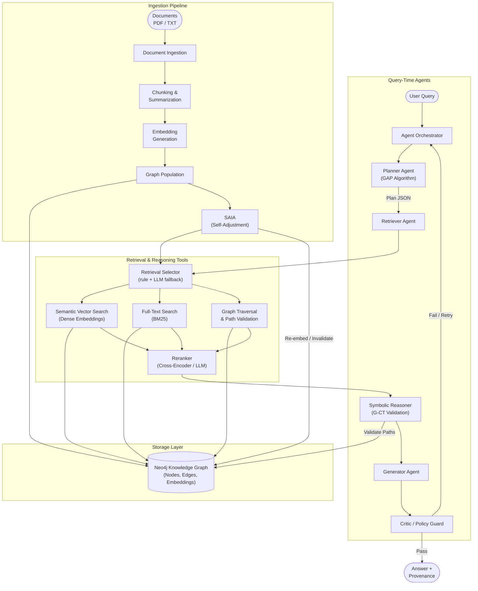

# How SAGE Graph RAG evolves into an intelligent, agent-driven, reasoning system

This document proposes a concrete methodology to upgrade SAGE from classic Graph RAG into an agentic, neuro-symbolic reasoning system suitable for enterprise use and Q1 journal publication. It outlines the architectural shift, agent orchestration, novel algorithms, safety/governance, metrics, and an evaluation harness—while preserving backward compatibility with the current repository.

---

## Big Picture (in very simple terms)

Classic RAG:

> Ask → Fetch documents → Stuff them into prompt → Answer

Agentic + Neuro-Symbolic Graph RAG:

> Ask → Plan → Think → Retrieve → Check rules → Answer → Verify

The system loops, thinks, checks itself, and proves its answers using:
- Neural intelligence (LLMs, embeddings)
- Symbolic intelligence (graphs, rules, constraints)

---

## Current System (Quick Summary)

- Retrieval and chat:
  - Streamlit UI and graph cosine similarity in [graph_rag.py](graph_rag.py)
  - LLM generation via Groq; uses chunk summaries and cosine similarity over stored embeddings
- Ingestion and graph population:
  - Document/message processing and chunking into Neo4j in [scripts/pipeline.py](../scripts/pipeline.py)
- Backend API:
  - FastAPI endpoints for chat, document ingestion, and graph debugging in [backend.py](backend.py)

This is a strong foundation: embeddings + Neo4j + LLM. The upgrade introduces planning, tool use, constraints, and verification.

---

## System Architecture

SAGE operates as a dual-flow system: a **query-time reasoning loop** powered by an agent orchestrator, and an **ingestion-time pipeline** that populates and maintains the knowledge graph. Both flows share Neo4j as the central knowledge store and leverage embeddings for semantic operations.

### Query-Time Flow

When a user submits a question, the **Agent Orchestrator** coordinates a multi-agent loop:

1. **Planner Agent (GAP)** — Receives the query and emits a schema-aware execution plan (JSON) referencing valid node types, edges, and constraints from the Neo4j schema.
2. **Retriever Agent** — Executes the plan's retrieval steps by invoking tools: Semantic Vector Search (dense embeddings), Full-Text Search (BM25), and Graph Traversal. Results are merged and passed to a Reranker tool.
3. **Symbolic Reasoner (G-CT)** — Applies Graph-Constrained Chain-of-Thought: validates that each reasoning step corresponds to an actual graph path. Invalid steps are rejected and trigger re-planning.
4. **Generator Agent** — Synthesizes the final answer from validated context and emits a provenance bundle (plan, paths, doc IDs).
5. **Critic / Policy Guard Agent** — Verifies grounding, citations, PII filters, and policy compliance. If checks fail, triggers a retry loop back to the Planner or Retriever.

### Ingestion-Time Flow

When new documents arrive (via API or batch), the **Ingestion Pipeline** processes them:

1. **Document Ingestion** — Raw files (PDF/TXT) are read and text is extracted.
2. **Chunking & Summarization** — Text is split into overlapping chunks; each chunk is summarized by an LLM.
3. **Embedding Generation** — Summaries are encoded into dense vectors (SentenceTransformer).
4. **Graph Population** — Nodes (`Document`, `Chunk`, `Person`) and relationships (`PART_OF`, `SENT`, `RECEIVED_BY`) are created/merged in Neo4j. Embeddings are stored as node properties.
5. **SAIA Trigger** — After storage, SAIA runs change detection, computes impact radius, performs incremental re-embedding, resolves conflicts, and invalidates stale plans.

### High-Level Architecture Diagram



### Algorithm Placement Summary

| Layer | Algorithm / Component | Role |
|-------|----------------------|------|
| **Agent (Planning)** | GAP — Graph-Augmented Planner | Schema-aware plan generation |
| **Tool (Retrieval)** | Dense Embeddings (SentenceTransformer) | Semantic similarity search |
| **Tool (Retrieval)** | BM25 (Full-Text) | Keyword / exact-match search |
| **Tool (Retrieval)** | Graph Traversal | Relationship-aware path queries |
| **Tool (Post-Retrieval)** | Reranker (Cross-Encoder / LLM) | Candidate re-scoring |
| **Agent (Reasoning)** | G-CT — Graph-Constrained CoT | Path validation, hallucination rejection |
| **Agent (Verification)** | Critic / Policy Guard | Grounding, PII, compliance checks |
| **Ingestion (Maintenance)** | SAIA | Change detection, re-embedding, conflict resolution |

---

## 1️⃣ Architectural Shift: From Pipeline to Thinking Loop

Old (single pass):

```
User Query
   ↓
Retrieve Docs
   ↓
LLM Generates Answer
```

New (agentic loop):

```
User Query
   ↓
Planner Agent
   ↓
Execute Steps (retrieve / reason / query graph)
   ↓
Verify & Critique
   ↓
Final Answer (with proof)
```

What changes:
- No more single pass
- System plans, acts, checks, retries
- Specialized agents handle distinct responsibilities

---

## 2️⃣ Agentic Orchestration Layer (The Brain Controller)

Introduce a lightweight orchestrator (LangGraph or AutoGen). It controls who does what and in what order.

Agents (roles):
- Planner (GAP): break question into constrained steps
- Retriever: hybrid retrieval (dense + BM25 + graph)
- Symbolic Reasoner: apply organizational rules, time constraints, graph path validity
- Generator: synthesize answer + provenance
- Critic/Safety: verify grounding, citations, policies; trigger retries if weak

Implementation note: Keep existing endpoints intact; add an `agentic_mode` toggle wired through [backend.py](backend.py) and [graph_rag.py](graph_rag.py).

---

## 3️⃣ Novel Algorithms (Key Research Contributions)

### 🔹 GAP — Graph-Augmented Planner (Neuro-Symbolic)
Problem: LLM planners ignore graph schema and over-plan free-form.
Solution: Planner conditioned on Neo4j schema + constraints. Plans must reference valid node types and relations.

Plan schema (JSON):
```json
{
  "steps": [
    {"type": "graph_lookup", "node": "Employee", "filter": {"name": "Alice"}},
    {"type": "traverse", "edge": "REPORTS_TO", "depth": 1},
    {"type": "rule_check", "policy": "APPROVAL_POLICY_2024"}
  ],
  "constraints": {"allowed_edges": ["REPORTS_TO", "APPROVES"], "max_depth": 3}
}
```

Pseudo-code (LangGraph):
```
planner(query) -> plan_json
executor(plan_json):
  for step in steps:
    if step.type == graph_lookup: cypher(...)
    if step.type == traverse: cypher(PATH CONSTRAINTS)
    if step.type == rule_check: rules_engine(...)
collect artifacts -> context
```

### 🔹 ISQA — Iterative Self-Querying Agent
Problem: Complex multi-hop questions fail in one shot.
Solution: Split into sub-questions with a bounded loop; each sub-answer updates context. Stops when confidence ≥ τ or budget exhausted.

Loop outline:
```
subqs = decompose(query)
for q in subqs:
  ctx += retrieve(q)
  if not valid(ctx): refine(q)
if confidence(ctx) < τ: fallback/retry
```

### 🔹 G-CT — Graph-Constrained Chain-of-Thought
Problem: Hallucinated reasoning steps.
Solution: Force CoT to align with actual graph paths. Invalid path → step rejected.

Constraint pattern:
- If Cypher path does not exist, the step cannot be used
- CoT template requires citing node IDs + relationship types

Example Cypher for path validation:
```
MATCH (e:Employee {name:$name})-[:REPORTS_TO]->(m:Manager)
WITH e,m
MATCH (m)-[:APPROVES]->(p:Policy {id:"2024"})
RETURN e,m,p
```
If no rows, reject the step and replan.

---

## 4️⃣ Neuro-Symbolic Reasoning (Together)

Neural side (soft): embeddings, semantic similarity, language understanding.
Symbolic side (hard): org rules, effective dates, graph structure.

Workflow:
1) Neural retrieval finds candidates
2) Symbolic constraints prune invalid ones
3) Generator produces answer + proof traces (IDs, paths, rules)

---

## 5️⃣ Hybrid Retrieval (Stronger Search)

Combine three sources:
- Dense vectors (SentenceTransformers)
- BM25 keyword (Elastic/Whoosh/Pyserini; simple baseline ok)
- Graph traversal (Neo4j paths; typed relationships)

Then:
- Rerank (Cross-Encoder or LLM-based reranker under token budget)
- Deduplicate
- Structured context packing (fixed template + token accounting)

Benefits: Higher recall/precision, lower hallucination.

---

## 6️⃣ Safety, Governance, and Audit (Enterprise-ready)

Built-in protections:
- PII filters (HR/Legal)
- Policy allow/deny rules
- Tool access control and rate limits

Provenance (auditable outputs):
- Document IDs (from Neo4j `Document.doc_id`)
- Node IDs/labels, edge types
- Execution plan (JSON), tool calls, validated paths

---

## 7️⃣ Modular Tools (Composable)

Add simple tool wrappers. Agents decide when to call them.
- `graph_query.py`: Cypher/Gremlin queries + path validators
- `vector_search.py`: dense + BM25 blended retrieval
- `rerank.py`: cross-encoder/LLM reranking
- `policy_guard.py`: rule engine + policy checks
- `sql_query.py`: optional structured data integration
- `code_exec.py`: sandboxed execution for calculative tasks
- `saia.py`: change detection, impact radius, incremental re-embedding, conflict resolution, plan invalidation (Self-Adjustment on Information Addition — SAIA)
- `retrieval_selector.py`: decides between full-text/BM25, semantic/embedding, or hybrid retrieval for SAIA and orchestrator use (rule-based heuristics with optional LLM fallback; logs decision reasons)

---

## 8️⃣ Pipeline Integration (Low-Risk Upgrade)

Keep classic Graph RAG intact; add a toggle:
```
agentic_mode = true | false
```
- `false` → existing flow in [graph_rag.py](graph_rag.py) / [backend.py](backend.py)
- `true` → route to orchestrator loop (LangGraph/AutoGen), with fallback to classic if weak/failed

---

## 9️⃣ Self-Critique and Verification Loop

Before returning:
- Critic checks grounding, citations, rule satisfaction
- If weak, re-retrieve or re-generate under constraints
- Final emits provenance bundle

---

## 🔟 End-to-End Data Flow

1) Query enters system
2) Planner emits JSON execution plan (schema-aware)
3) Retrieval returns documents + graph paths
4) Symbolic reasoner applies rules + prunes invalid paths
5) Generator writes answer + cites artifacts
6) Critic verifies and may loop once
7) Final answer + provenance returned
8) If new data was ingested, SAIA triggers: change detection → impact radius → incremental re-embedding → conflict resolution → plan invalidation → optional proactive re-reasoning


---

## 1️⃣1️⃣ Evaluation & Regression Testing (Publishable)

Extend the existing framework in [scripts/performance_comparison.py](../scripts/performance_comparison.py) with the following metrics:
- Grounding rate: % answers with valid supporting artifacts
- Hallucination rate: % steps rejected by G-CT validator
- Graph path accuracy: % claimed paths that exist in Neo4j
- Tool-call faithfulness: % tool outputs used consistently in CoT
- Rule satisfaction: % answers passing `policy_guard`
- Latency per stage: planner, retrieval, reasoning, generation, critique
- Rerank uplift: Δ quality with reranker vs. none

Harness design:
- Use [data/eval/qa_pairs.json](../data/eval/qa_pairs.json) + [data/eval/test_queries.json](../data/eval/test_queries.json)
- Create ablation suites: {dense-only, bm25-only, graph-only, hybrid}, {no-constraints vs. G-CT}, {no-critique vs. critic}
- Persist artifacts to `results/` (JSON + HTML report via [scripts/generate_report.py](../scripts/generate_report.py))

Reporting:
- Confidence intervals via bootstrapping
- Path visualizations (Cypher → Mermaid diagrams) with error bars

---

## 1️⃣2️⃣ Backend & UI Integration

Backend:
- New endpoint: `/api/agent_chat` that streams plan → tool calls → constraints → answer → provenance
- Toggle in request body: `{ agentic_mode: true }`

Streamlit:
- Add “Agent Mode” toggle in [graph_rag.py](graph_rag.py)
- Live panes for: planner steps, tool calls, validated paths, critic verdicts

---

## 1️⃣3️⃣ Academic / Journal Value (Contributions)

Claimable contributions:
- Hallucination reduction via graph-constrained CoT (G-CT)
- Schema-aware Graph-Augmented Planning (GAP)
- Iterative Self-Querying Agent (ISQA) for multi-hop QA
- Neuro-symbolic integration with enterprise graph rules
- Auditable provenance under enterprise constraints
- Self-Adjustment on Information Addition (SAIA): reactive graph maintenance with incremental re-embedding, conflict resolution, and proactive re-reasoning

Formalization:
- Define GAP/ISQA/G-CT/SAIA as repeatable, evaluatable patterns
- Provide pseudo-code and plan schemas; report metrics and ablations

---


## 1️⃣4️⃣ Self-Adjustment on Information Addition (SAIA)

Problem: In enterprise environments, knowledge is not static. New documents arrive continuously—memos, policy updates, status reports—and each can contradict, supplement, or obsolete existing graph knowledge. Classic RAG systems treat ingestion as a one-time store operation with no downstream consequences. This means stale embeddings, broken reasoning paths, and answers grounded in outdated facts.

Solution: SAIA is a reactive subsystem that triggers automatically whenever new information enters the graph. It detects what changed, computes the blast radius, and self-adjusts the affected parts of the knowledge infrastructure.

### Plan

#### The Problem (Current State)

Right now, ingestion is fire-and-forget. When a new document lands, the system:
- Creates `Document` / `Chunk` / `Person` nodes via `MERGE`
- Embeds summaries and stores them
- **Does nothing** about existing graph knowledge that the new document may contradict, supplement, or invalidate

There's no impact propagation, no staleness detection, no re-indexing, and no plan invalidation.


---

### SAIA Pipeline (6 stages)

#### Stage 1: Change Detection & Fact Diffing

#### Stage 1.5: Retrieval Method Selection (Selector Agent)

Before retrieving supporting artifacts or re-embedding, the **Retrieval Selector** decides which retrieval modality is appropriate for the incoming document or subquery:

- **Full-text / BM25**: preferred when the document/query contains precise identifiers (EMP IDs, doc IDs), exact phrases, or date ranges where keyword matches work best.
- **Semantic / Embedding**: preferred for ambiguous, paraphrased, or concept-level matches where lexical overlap is low.
- **Hybrid**: run both and merge candidates with a reranker when high recall is needed.

Selection logic (hybrid rule+LLM fallback):
- Use fast deterministic rules first (presence of EMP\d{3}, short queries, date tokens, numeric IDs → BM25; long/ambiguous text, natural language questions → Embedding).
- If rules are inconclusive (low confidence), call a small LLM classifier prompt to pick or to vote between modalities.
- Log selector decision, the signals used, and fallback actions. If chosen modality returns poor coverage, auto-fallback to the other method.

This selector sits inside SAIA and the orchestrator so both ingestion-time adjustments and query-time retrieval benefit from modality-aware search.

#### Stage 2: Impact Radius Computation

Given the diff, compute which parts of the graph are affected. This is a graph neighborhood problem.

Impact radius is bounded (max depth = 2 hops) to keep computation tractable. The output is a structured `ImpactReport`:

```json
{
  "trigger_doc": "doc-abc123",
  "diff_summary": {"added": 3, "modified": 1, "contradicted": 1, "confirmed": 5},
  "affected_nodes": ["EMP001", "EMP004", "doc-xyz789"],
  "affected_chunks": ["doc-xyz789-chunk-0", "doc-xyz789-chunk-2"],
  "affected_plans": ["plan-q17", "plan-q22"],
  "severity": "high"
}
```

Severity levels:
- **Low**: only additions, no existing facts touched
- **Medium**: modifications to non-critical attributes (e.g., subject line change)
- **High**: contradictions detected, or modifications to structural relationships (REPORTS_TO, APPROVES)

#### Stage 3: Incremental Re-Embedding

Only re-embed chunks whose semantic context has materially changed. This avoids a full re-index.

Key insight: a chunk's meaning can change even if its text doesn't, because the graph context around it changed. For example, if a chunk says "the team lead approved the budget" and a new document reveals a different team lead, the chunk's embedding should reflect the updated context.

The threshold δ prevents unnecessary re-embedding when changes are cosmetic.

#### Stage 4: Graph Consistency Resolution

When contradictions are detected, the system must decide how to resolve them. Three strategies, selectable per-deployment:

1. **Temporal precedence** (default): newer document wins. The old relationship is marked `{status: "superseded", superseded_by: new_doc_id, superseded_at: timestamp}` rather than deleted (preserving audit trail).

2. **Confidence-weighted**: both facts coexist with confidence scores. The planner and reasoner see both and weigh them during answer generation.

3. **Flag for human review**: contradictions above a severity threshold are queued for human resolution. The affected graph region is marked `{pending_review: true}` and the reasoner treats it as uncertain.

#### Stage 5: Plan & Cache Invalidation

Cached execution plans (from GAP) that reference affected nodes/edges are invalidated. This prevents stale reasoning paths.


Additionally, any monitored/recurring queries whose provenance bundles reference affected nodes are marked as `stale`. The next time these queries are asked, the system:
- Re-plans from scratch (does not reuse the cached plan)
- Logs that re-planning was triggered by SAIA

#### Stage 6: Proactive Re-Reasoning (Optional)

For enterprise-critical queries (marked as `monitored`), SAIA can proactively re-run them when high-severity changes are detected:

This turns SAGE from a passive Q&A system into an active knowledge monitor that alerts when answers change due to new information.

---

### SAIA in the Orchestrator Loop

SAIA runs as a post-ingestion hook, not during query time. The integration:

```
Ingestion Pipeline
       ↓
Store Document + Chunks + Persons  (existing)
       ↓
SAIA Trigger
       ↓
[Change Detection] → [Impact Radius] → [Re-Embed] → [Resolve Conflicts] → [Invalidate Plans] → [Re-Reason?]
       ↓
Graph is now self-adjusted
```

### SAIA Evaluation Metrics

- **Staleness detection rate**: % of contradictions/modifications correctly identified
- **Re-embedding efficiency**: % of chunks re-embedded vs. total chunks (lower is better)
- **Conflict resolution accuracy**: % of contradictions resolved correctly (vs. human judgment)
- **Plan invalidation precision**: % of invalidated plans that genuinely needed re-planning
- **Proactive alert relevance**: % of stakeholder notifications that were actionable
- **Adjustment latency**: time from document ingestion to full self-adjustment completion
- **Selector Accuracy**: % of times the Retrieval Selector chose the modality (BM25 / Embedding / Hybrid) that produces the best result (oracle or human-labelled) — measures decision quality.
- **Selector Cost Efficiency**: average compute cost saved when selector picks a cheaper modality vs always running hybrid (measured in embedding calls or LLM classifier calls avoided).
- **Selector-induced Recall/Uplift**: change in staleness-detection or grounding recall when using selector vs naive strategy (hybrid/all).```

---


## Suggested Implementation Roadmap (Non-breaking)

Short term (1–2 weeks):
- Add orchestrator module and `agentic_mode` toggle
- Implement GAP planner (schema-conditioned prompts)
- Implement graph path validator + minimal `policy_guard`
- Hybrid retrieval baseline (BM25 + dense + graph)

Medium term (2–4 weeks):
- Add reranker; integrate provenance packing
- Implement critic loop; wire fallbacks
- Extend evaluation metrics + ablations; generate HTML report
- Implement SAIA change detection + impact radius computation
- Add incremental re-embedding with semantic distance threshold
- Wire conflict resolution strategies (temporal / confidence / human-review)

Long term (4–8 weeks):
- UI telemetry of plans/paths
- SQL/data warehouse tool integration
- Advanced rule engine and safety filters
- Proactive re-reasoning for monitored queries
- SAIA dashboard in Streamlit (impact reports, conflict queue, staleness alerts)
---

## Appendix: Minimal Orchestration Sketch (LangGraph)

```
from langgraph import Graph

G = Graph()

@G.node
def planner_node(state):
  return plan_json

@G.node
def retrieve_node(state):
  return artifacts

@G.node
def reason_node(state):
  return pruned_artifacts

@G.node
def generate_node(state):
  return answer

@G.node
def critic_node(state):
  return verdict

G.edge(planner_node, retrieve_node)
G.edge(retrieve_node, reason_node)
G.edge(reason_node, generate_node)
G.edge(generate_node, critic_node)
G.edge(critic_node, generate_node, condition="retry")

result = G.run(query)
```

---

## Final One-Line Summary

This proposal upgrades SAGE Graph RAG from a simple document retriever into an agent-driven, neuro-symbolic reasoning system that plans, reasons over graphs, applies rules, verifies itself, and produces auditable, trustworthy answers—ready for enterprise and Q1-level publication.


## When to use planning & thinking (types of questions) 🔎 
Multi-hop / chained reasoning — e.g., “Which manager approved all expenses for Project X and who reported to those managers?” (needs graph traversals + aggregation)
Temporal or conditional queries — e.g., “Who had approval authority on 2024-03-15 after Policy Y became effective?” (needs time constraints + rule checks)
Rule-/policy-constrained decisions — e.g., “Was the approval compliant with APPROVAL_POLICY_2024?” (requires policy_guard verification)
Ambiguous / underspecified questions — e.g., “Which emails are relevant to the budget issue?” (requires decomposition and iterative retrieval)
Cross-source synthesis & reconciliation — e.g., “Summarize conflicting statements across messages and policy documents.” (needs evidence aggregation + conflict detection)
Audit / provenance requests — e.g., “Show supporting paths and documents for this decision.” (must produce graph paths, doc IDs, execution plan)
Tooled tasks or calculations — e.g., “Compute total approved spend for Q1 by department.” (may call DB queries / calculators)
