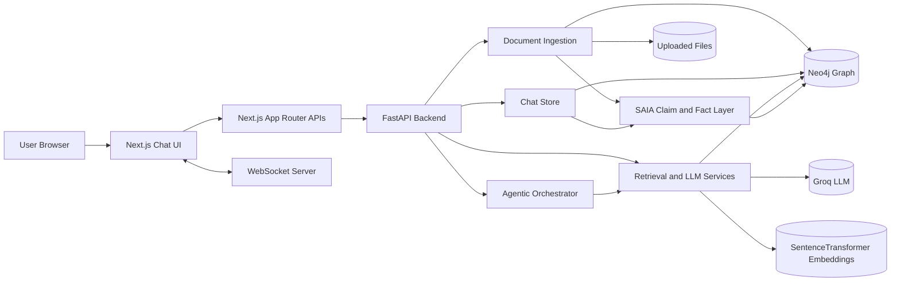
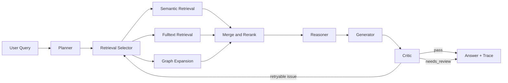
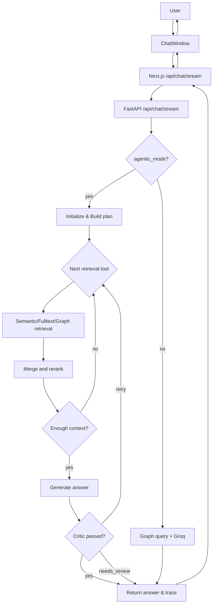
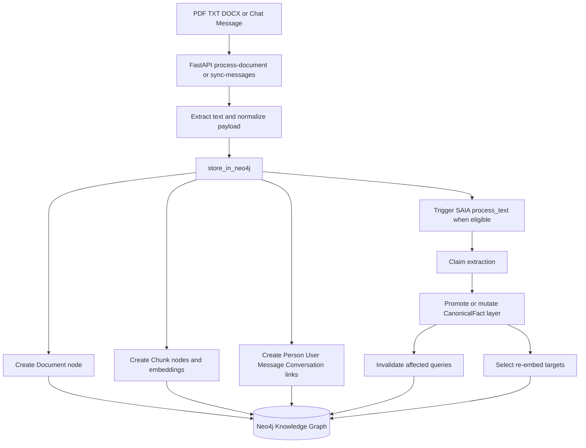
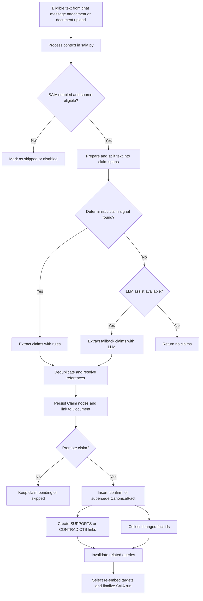
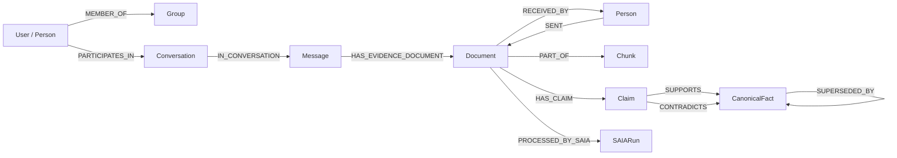
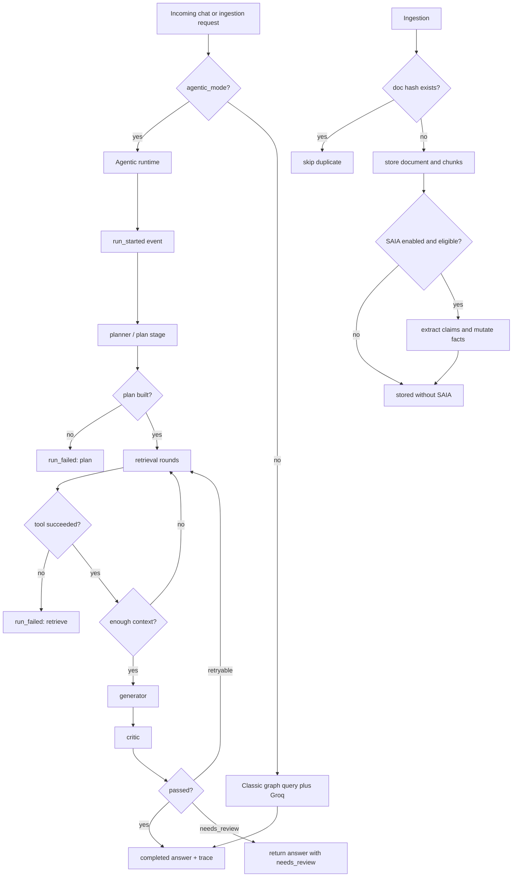

# Low-Level Design: SAGE System

## 1. Purpose and Scope

This document captures the implemented low-level design of the current SAGE system across:

- `ChatAppSAGE` - Next.js client, API proxy, websocket updates, and provenance UI
- `SAGE-Enterprise-Graph-RAG` - FastAPI backend, agentic query loop, ingestion, SAIA, and Neo4j integration

This is an implementation-grounded LLD. It is based on the code in `app/`, `src/`, and the current repository documentation, not only on the research proposal.

Mermaid note:

- The Mermaid diagrams in this document were validated through the installed Mermaid MCP server (`claude-mermaid`).
- Rendered PNG exports were saved under `mermaid-artifacts/`.

## 2. System Boundary

SAGE is a two-tier application with a shared graph data layer:

1. The browser and Next.js application provide authentication, chat UX, streaming answer updates, message views, and graph/provenance debug views.
2. The FastAPI backend owns the chat APIs, agentic orchestration, document ingestion, chat persistence, SAIA processing, and graph retrieval/generation.
3. Neo4j is the runtime system of record for users, groups, conversations, messages, documents, chunks, claims, and canonical facts.
4. Groq and local embedding/reranking models provide the neural layer on top of the graph layer.

## 3. Major Components

| Layer | Component | Responsibility | Main files |
| --- | --- | --- | --- |
| Presentation | Chat UI and debug views | Chat window, streaming answer UX, provenance sheet, agent rail, upload flows | [ChatWindow.tsx](ChatAppSAGE/src/app/components/ChatWindow.tsx), [MessageTraceSheet.tsx](ChatAppSAGE/src/app/components/MessageTraceSheet.tsx), [AgentExecutionRail.tsx](ChatAppSAGE/src/app/components/AgentExecutionRail.tsx) |
| Next.js server layer | API proxy and bootstrap | Session-aware proxy to FastAPI, backend bootstrap from seed JSON, timeout handling | [backend.ts](ChatAppSAGE/src/lib/server/backend.ts), [route.ts](ChatAppSAGE/src/app/api/chat/stream/route.ts) |
| Realtime layer | Websocket broadcast | Push message-created and message-read events to active clients | [websocket.ts](ChatAppSAGE/src/lib/server/websocket.ts), [websocket-server.js](ChatAppSAGE/websocket-server.js) |
| API edge | FastAPI endpoints | Chat, streaming chat, process-document, auth, profile, groups, conversations, debug endpoints | [backend.py](SAGE-Enterprise-Graph-RAG/app/backend.py) |
| Agent runtime | Planner, retriever, reasoner, generator, critic loop | Create plan, execute retrieval rounds, validate evidence, generate answer, retry if critic fails | [orchestrator.py](SAGE-Enterprise-Graph-RAG/app/orchestrator.py), [agentic.py](SAGE-Enterprise-Graph-RAG/app/agentic.py) |
| Retrieval core | Query routing and ranking | Retrieval selection, vector/fact search, graph expansion, reranking, coverage validation | [retrieval_selector.py](SAGE-Enterprise-Graph-RAG/app/retrieval_selector.py), [services.py](SAGE-Enterprise-Graph-RAG/app/services.py), [graph_query.py](SAGE-Enterprise-Graph-RAG/app/graph_query.py), [rerank.py](SAGE-Enterprise-Graph-RAG/app/rerank.py), [policy_guard.py](SAGE-Enterprise-Graph-RAG/app/policy_guard.py) |
| Persistence | Chat and auth store | Canonical Neo4j-backed storage for users, groups, conversations, messages, read state, and SAGE conversations | [chat_store.py](SAGE-Enterprise-Graph-RAG/app/chat_store.py) |
| Ingestion | Document extraction and graph write path | Read uploaded files, build payloads, split into chunks, store embeddings and relations | [document_ingestion.py](SAGE-Enterprise-Graph-RAG/app/document_ingestion.py), [services.py](SAGE-Enterprise-Graph-RAG/app/services.py) |
| Post-ingestion maintenance | SAIA | Extract graph-worthy claims, maintain canonical facts, detect conflicts, invalidate stale queries, select re-embed targets | [saia.py](SAGE-Enterprise-Graph-RAG/app/saia.py) |

## 4. Agent Design

The "agents" in SAGE are not separate microservices. They are in-process roles coordinated by one orchestrator state machine.

| Agent role | Responsibility | Implementation notes |
| --- | --- | --- |
| Planner | Infer intent, entities, evidence needs, graph depth, and tool sequence | `build_plan()` combines retrieval selection, query-shape analysis, and schema constraints in [agentic.py](SAGE-Enterprise-Graph-RAG/app/agentic.py) |
| Retriever | Run semantic, fulltext, and graph retrieval rounds | `_run_retrieval_round()` dispatches to vector search or graph expansion and merges results |
| Reasoner | Validate graph/fact/document bindings and coverage | `validate_trace_paths()` in [graph_query.py](SAGE-Enterprise-Graph-RAG/app/graph_query.py) |
| Generator | Build the final grounded answer payload | `generate_groq_response()` in [services.py](SAGE-Enterprise-Graph-RAG/app/services.py) |
| Critic | Enforce minimal grounding and policy-sensitive provenance checks | `evaluate_answer()` in [policy_guard.py](SAGE-Enterprise-Graph-RAG/app/policy_guard.py) |
| SAIA agent | Maintain post-ingestion claim and fact consistency | `process_text()` and its mutation pipeline in [saia.py](SAGE-Enterprise-Graph-RAG/app/saia.py) |

Important low-level characteristics:

- The planner uses a schema snapshot from `graph_query.py` to constrain node and edge types.
- The retriever can switch between `semantic`, `fulltext`, and `graph` tools based on heuristic or optional LLM-aided selection.
- The critic can trigger one bounded retry with an alternate retrieval tool.
- All agent events are emitted into the trace so the frontend can render the execution rail.

## 5. Query-Time Control Flow

The implemented query-time path is:

1. The user sends a message from the Next.js chat window.
2. The Next.js route attaches the authenticated `user_id` and proxies the request to FastAPI.
3. FastAPI chooses the agentic path by default (`agentic_mode=True`).
4. The orchestrator initializes `OrchestratorState`, emits start events, and asks the planner for a plan.
5. The planner decides the retrieval strategy, graph depth, constraints, stop conditions, and tool order.
6. The retriever executes one or more retrieval rounds using semantic search, BM25/fulltext search, and graph expansion.
7. The reranker orders merged evidence, and the reasoner validates bindings and coverage.
8. The generator produces a grounded answer payload through Groq.
9. The critic either passes the answer or asks for one retry.
10. FastAPI streams `progress` and `final` SSE events back to the UI.

### Query-time internal state

`OrchestratorState` stores:

- current plan
- retrieval trace
- tool calls and rounds
- validated bindings
- open questions
- coverage status
- stop reason
- critic verdict
- completed steps for provenance

This state is serialized back into `trace.agentic` so the UI can display both summary and detailed evidence.

## 6. Ingestion Flow and SAIA Update Path

The ingestion path is shared by uploaded documents and graph-eligible chat evidence:

1. FastAPI receives a file upload or synced chat/message payload.
2. Text is extracted and normalized into a document payload.
3. `store_in_neo4j()` creates the `Document` node, summary, embeddings, chunks, and sender/receiver relations.
4. If SAIA is enabled and the source is eligible, `process_text()` extracts graph-worthy claims.
5. Claims are confirmed, promoted, superseded, or marked for review against the `CanonicalFact` layer.
6. SAIA returns affected nodes, invalidated query ids, and re-embed targets.

Low-level ingestion details:

- Short content is stored as one chunk; larger content is chunked with overlap.
- Duplicate documents are skipped by `doc_id` / content hash.
- Uploaded attachments are linked back to the originating chat message when available.
- SAIA is intentionally additive: raw chat/document evidence remains immutable while the claim/fact layer evolves separately.

## 7. Core Data Model

SAGE uses two overlapping data layers in Neo4j:

- chat/runtime layer: `User`, `Group`, `Conversation`, `Message`
- retrieval/evidence layer: `Document`, `Chunk`
- SAIA reasoning layer: `Claim`, `CanonicalFact`

Key modeling rules:

- `User` is also a `Person`.
- `Message` is the chat object; `Document` is the retrieval/evidence object.
- A message can point to an evidence document, but not every message must do so.
- `Claim` and `CanonicalFact` form a mutable reasoning layer on top of immutable source evidence.

Common property types:

- identifiers such as `id`, `doc_id`, `chunk_id`, `fact_id`, and `claim_id`
- text fields such as `name`, `subject`, `summary`, `content`, and `canonical_key`
- timestamps such as `sent_at` and `timestamp`
- status fields such as `status`, `promotion_status`, `graph_sync_status`, and `source`
- structured payloads such as embeddings, trace JSON, receiver lists, and team lists

Typical examples:

- `User {id: "u_001", name: "Asha"}`
- `Group {id: "g_sales", name: "Sales"}`
- `Conversation {id: "direct:u_001:u_002", type: "direct"}`
- `Message {id: "m_42", content: "Charlie reports to Diana", sent_at: "2026-05-17T10:00:00Z"}`
- `Document {doc_id: "doc_abc", subject: "Project Alpha review", source: "message_attachment"}`
- `Chunk {chunk_id: "doc_abc-1", summary: "Project Alpha review next Monday"}`
- `Claim {claim_id: "claim_7", claim_type: "REPORTS_TO", promotion_status: "promoted"}`
- `CanonicalFact {fact_id: "fact_9", canonical_key: "reports_to::charlie", status: "current"}`

## 9. Observability, State, and Failure Handling

### Execution visibility

The system exposes execution state through:

- SSE progress events during agentic chat
- `trace.agentic.events` for the execution rail
- `trace.agentic.completed_steps`, `current_step`, `stop_reason`, and critic verdicts for provenance
- `MessageTraceSheet` for answer provenance and SAIA insight
- graph debug endpoints for retrieval path, retrieval state, and subgraph inspection

### Failure and fallback behavior

- If `agentic_mode=False`, the backend falls back to the classic graph-query plus Groq generation path.
- If the planner fails, the run emits `run_failed` with stage `plan`.
- If a retrieval round fails, the run emits `run_failed` with stage `retrieve` and the error is surfaced in the trace.
- If evidence coverage is weak, the trace reports `no_evidence` or `partial_evidence` and the critic can mark the answer `needs_review`.
- If reranking or structured generation fails, the backend falls back to simpler answer packaging.
- If the streaming endpoint is unavailable, the Next.js route falls back to the standard chat endpoint and still emits a synthetic SSE response.
- If SAIA is disabled or a source is not eligible, ingestion still succeeds and the document remains queryable.
- If a document already exists by content hash, ingestion is skipped instead of duplicating graph data.
- If Neo4j is unavailable, the API returns a graph-unavailable error instead of silently degrading.

### Current implementation boundaries

- The critic is intentionally lightweight; it checks grounding and policy-sensitive provenance, not a full rule engine.
- The retrieval selector is mostly heuristic, with optional LLM fallback.
- The agent roles are logical stages inside one process, not separately deployed agents.
- Reranker quality depends on local cross-encoder availability.

## 10. Code Traceability

Use these files as the primary implementation map:

- FastAPI entry and endpoints: [backend.py](SAGE-Enterprise-Graph-RAG/app/backend.py)
- Orchestrator runtime: [orchestrator.py](SAGE-Enterprise-Graph-RAG/app/orchestrator.py)
- Planner and retrieval loop helpers: [agentic.py](SAGE-Enterprise-Graph-RAG/app/agentic.py)
- Core retrieval and generation services: [services.py](SAGE-Enterprise-Graph-RAG/app/services.py)
- Graph expansion and validation: [graph_query.py](SAGE-Enterprise-Graph-RAG/app/graph_query.py)
- Retrieval selection: [retrieval_selector.py](SAGE-Enterprise-Graph-RAG/app/retrieval_selector.py)
- Reranking: [rerank.py](SAGE-Enterprise-Graph-RAG/app/rerank.py)
- Critic and grounding checks: [policy_guard.py](SAGE-Enterprise-Graph-RAG/app/policy_guard.py)
- Chat/auth/conversation persistence: [chat_store.py](SAGE-Enterprise-Graph-RAG/app/chat_store.py)
- File ingestion helpers: [document_ingestion.py](SAGE-Enterprise-Graph-RAG/app/document_ingestion.py)
- SAIA claim and fact maintenance: [saia.py](SAGE-Enterprise-Graph-RAG/app/saia.py)
- Frontend chat and provenance UX: [ChatWindow.tsx](ChatAppSAGE/src/app/components/ChatWindow.tsx), [MessageTraceSheet.tsx](ChatAppSAGE/src/app/components/MessageTraceSheet.tsx), [AgentExecutionRail.tsx](ChatAppSAGE/src/app/components/AgentExecutionRail.tsx)

## 11. Final Summary

The implemented SAGE system is a graph-centric enterprise chat and retrieval platform with:

- a Next.js chat frontend and proxy layer
- a FastAPI backend that defaults to an agentic plan-retrieve-reason-generate-critic loop
- Neo4j as the canonical runtime and evidence graph
- a separate SAIA claim/fact maintenance layer for post-ingestion graph adaptation
- first-class provenance and debug surfaces exposed back to the UI

This design is already beyond a simple RAG pipeline. The current codebase supports both operational chat workflows and a graph-aware reasoning path with visible orchestration traces.
